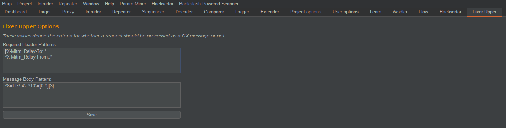
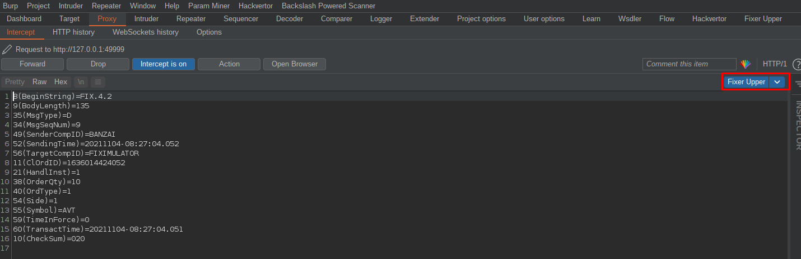

# FixerUpper v0.1

A Burp extension to enable modification of FIX messages when relayed from MitM_Relay

Blog post:
https://labs.f-secure.com/blog/a-bit-of-a-fixer-upper-playing-with-the-fix-tcp-protocol

# Installation

Can be manually installed by cloning this repository and then from within Burp Suite:
1. selecting the Extender tab
2. clicking the Add button
3. changing the Extension type to Python
4. selecting fixerupper.py as the extension file.

### Note

The extension requires Burp Suite to be configured to use Jython. For installation please see:
https://portswigger.net/burp/help/extender.html#options_pythonenv

FixerUpper is designed and intended to help with interception and modification of the TCP-based FIX protocol. As such, it is expected to be used with a TCP relay tool like MitM_Relay.py:
https://github.com/jrmdev/mitm_relay

# Basic Usage

After adding the extension you can define regular expressions for required HTTP headers, as well as the request body structure:

With this done, you will then get a "Fixer Upper" tab in the request window: 

